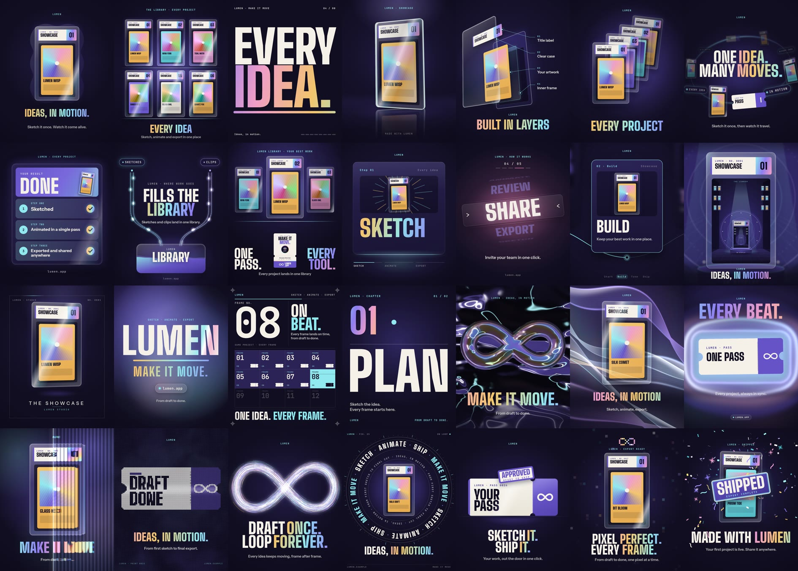
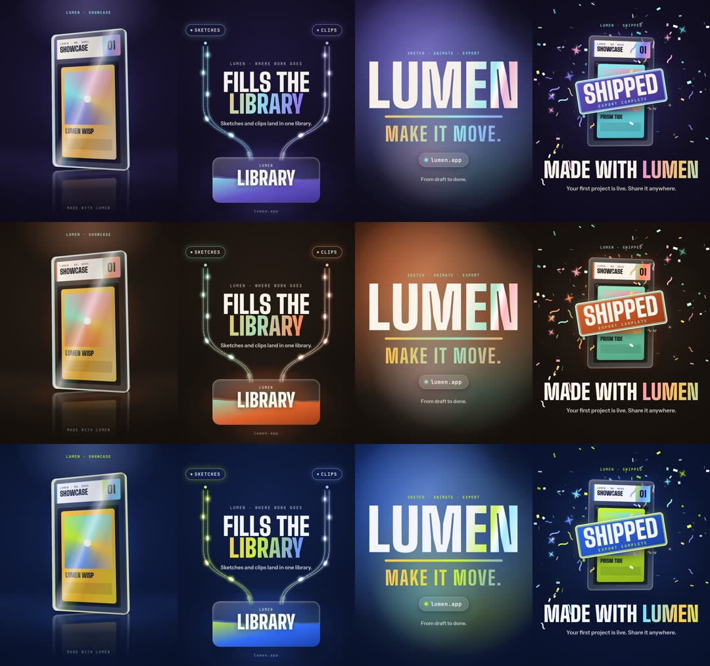

# motion-design-skills

**Give your AI agent a motion designer.** Point Claude Code (or any agent that reads skills) at this repo, then ask something like *"make an animated video for my software"*. Instead of dumping effects on you, the agent runs a short intake (what the video is for, who sees it, what it must show or teach, how it should feel, format, brand, call to action), writes a shot plan you approve, and then builds the video from 28 production-ready motion styles with real, editable source, rendered to MP4.



## What's inside

- **One skill, `motion-design`** ([SKILL.md](skills/motion-design/SKILL.md)): intake → plan → build → self-review → deliver. It triggers on asks like "animate this", "make an explainer", "launch video for my app", "logo animation", "make a reel".
- **28 styles** as deterministic HTML pages (`skills/motion-design/kit/styles/`), each with a doc (`references/styles/`) covering feeling, use, mechanism, timing and swap points. Browse the loops in the table below, or open `gallery/index.html` locally for a playing gallery.
- **A theme file** (`kit/theme.css`): colours and fonts as roles. Change one file (or pass `--theme`) and every style rebrands. Three example themes included:

  

- **A film template** (`kit/templates/film.html`) that strings scenes together with transitions and captions into one timeline.
- **A renderer** (`kit/render.mjs`): Playwright + ffmpeg, frame-exact MP4, poster and contact sheet, with `--size`, `--theme`, `--copy` and `--audio`.
- **Motion rules and a critic checklist** so the agent reviews its own frames before showing you anything.

## Install

**Claude Code, as a plugin**

```
/plugin marketplace add BusyBee3333/motion-design-skills
/plugin install motion-design@motion-design-skills
```

**Claude Code, per project**: copy `skills/motion-design` into your project's `.claude/skills/` (or `~/.claude/skills/` for every project).

**Claude.ai / Claude apps**: zip `skills/motion-design` and upload it under Settings → Capabilities → Skills. Rendering needs a code-execution environment with Chromium and ffmpeg.

**Any other agent**: point it at `skills/motion-design/SKILL.md` and tell it to follow it. Everything it needs is relative to that file.

Requirements for rendering: Node 18+, ffmpeg, and Chromium via `npx playwright install chromium` (or `CHROMIUM_PATH=/path/to/chrome`).

## Try it

```bash
cd skills/motion-design/kit
npm i && npx playwright install chromium
node render.mjs styles/16-colorfield-lockup.html --still 1          # one still, a few seconds
node render.mjs styles/16-colorfield-lockup.html --theme themes/ember.css   # full loop in another theme
node render.mjs templates/film.html                                  # a 14 s multi-scene demo film
```

Output lands in `skills/motion-design/kit/renders/`.

Then just talk to your agent:

> Make an animated video for my software.

and it will ask you about seven short questions (or fewer if you already said enough), show you a plan like this, and build after you say yes:

```
| # | Time  | Viewer sees                       | On-screen words               | Style                  |
| 1 | 0-2.5 | Big words cut on the beat         | "Meeting notes. / Nobody acts."| 03 Kinetic Type        |
| 2 | 2.5-7 | Your real app screen assembles    | "Tally turns notes into tasks" | 08 Materializing Result|
| 3 | 7-12  | Three steps fold into each other  | "Paste / Assign / Done"        | 11 Perspective Fold    |
| 4 | 12-16 | Tasks flow along rails to a board | "Everyone knows what's next"   | 09 Persistent Rails    |
| 5 | 16-20 | Logo lockup on a colour field     | "Try Tally free · tally.app"   | 16 Colour-Field Lockup |
```

## The styles

<!--STYLES-->
| # | Style | Good for | Feels | Preview |
|---|---|---|---|---|
| 01 | **Liquid Morph** | Openers, brand stings, and turning one object into another. | fluid, soft, premium, alive | [poster](gallery/v/01-liquid-morph.jpg) · [loop](gallery/v/01-liquid-morph.mp4) |
| 02 | **Fly-Through** | Going from a big claim to the proof in one cut. | bold, fast, cinematic, confident | [poster](gallery/v/02-foreground-flythrough.jpg) · [loop](gallery/v/02-foreground-flythrough.mp4) |
| 03 | **Kinetic Type** | Hooks in the first 3 seconds and music-cut social edits. | loud, rhythmic, punchy, graphic | [poster](gallery/v/03-kinetic-type-beats.jpg) · [loop](gallery/v/03-kinetic-type-beats.mp4) |
| 04 | **Showcase Hero** | Making one object feel physical and premium. | premium, physical, calm, expensive | [poster](gallery/v/04-acrylic-slab-hero.jpg) · [loop](gallery/v/04-acrylic-slab-hero.mp4) |
| 05 | **Exploded Layers** | Product anatomy: showing what something is made of. | technical, precise, credible, premium | [poster](gallery/v/05-exploded-layers.jpg) · [loop](gallery/v/05-exploded-layers.mp4) |
| 06 | **Stack and Fan** | Collection reveals and showing variety. | satisfying, abundant, tactile, polished | [poster](gallery/v/06-stack-fan.jpg) · [loop](gallery/v/06-stack-fan.mp4) |
| 07 | **Artifact Ring** | One line of copy surrounded by the things it's about. | orbiting, dimensional, confident, airy | [poster](gallery/v/07-artifact-ring.jpg) · [loop](gallery/v/07-artifact-ring.mp4) |
| 08 | **Materializing Result** | Reveal a result or summary screen step by step without a real UI. | precise, satisfying, calm, premium | [poster](gallery/v/08-materializing-result.jpg) · [loop](gallery/v/08-materializing-result.mp4) |
| 09 | **Persistent Rails** | Explain two inputs flowing into one destination. | clear, flowing, steady, confident | [poster](gallery/v/09-persistent-rails.jpg) · [loop](gallery/v/09-persistent-rails.mp4) |
| 10 | **Logo Portal** | Logo open or close; a brand mark that opens into the product world. | hypnotic, playful, premium, endless | [poster](gallery/v/10-logo-portal.jpg) · [loop](gallery/v/10-logo-portal.mp4) |
| 11 | **Perspective Fold** | 3-step how-it-works sequences. | tidy, tactile, confident, rhythmic | [poster](gallery/v/11-perspective-fold.jpg) · [loop](gallery/v/11-perspective-fold.mp4) |
| 12 | **Step Carousel** | Ordered lists of 3-7 short words (steps, features). | energetic, ordered, bold, rhythmic | [poster](gallery/v/12-carousel-emphasis.jpg) · [loop](gallery/v/12-carousel-emphasis.mp4) |
| 13 | **Camera Journey** | A whole flow in one continuous shot; roadmaps and overviews. | spatial, guided, smooth, cinematic | [poster](gallery/v/13-camera-journey.jpg) · [loop](gallery/v/13-camera-journey.mp4) |
| 14 | **Recursive Zoom** | Hypnotic endless sting behind a fixed caption. | hypnotic, endless, calm, premium | [poster](gallery/v/14-recursive-zoom.jpg) · [loop](gallery/v/14-recursive-zoom.mp4) |
| 15 | **Velvet Standard** | Calm luxury spotlights and expensive end cards. | calm, luxurious, expensive, unhurried | [poster](gallery/v/15-velvet-standard.jpg) · [loop](gallery/v/15-velvet-standard.mp4) |
| 16 | **Colour-Field Lockup** | End-card lockups with a wordmark and URL. | bold, warm, premium, confident | [poster](gallery/v/16-colorfield-lockup.jpg) · [loop](gallery/v/16-colorfield-lockup.mp4) |
| 17 | **Swiss Grid** | Hard-cut rhythm, counts and "same every time" proof beats. | precise, rhythmic, editorial, confident | [poster](gallery/v/17-swiss-grid.jpg) · [loop](gallery/v/17-swiss-grid.mp4) |
| 18 | **Tile Wipe** | Chapter breaks in step-by-step explainers. | punchy, graphic, rhythmic, playful | [poster](gallery/v/18-tile-wipe.jpg) · [loop](gallery/v/18-tile-wipe.mp4) |
| 19 | **Liquid Chrome** | Abstract hero openers behind a headline. | sleek, futuristic, luxurious, hypnotic | [poster](gallery/v/19-liquid-chrome.jpg) · [loop](gallery/v/19-liquid-chrome.mp4) |
| 20 | **Silk Ribbons** | Slow, elegant backdrops for a product. | elegant, soft, premium, flowing | [poster](gallery/v/20-silk-ribbons.jpg) · [loop](gallery/v/20-silk-ribbons.mp4) |
| 21 | **Aura Bloom** | Heartbeat or "it's live" pulse moments. | alive, warm, rhythmic, magnetic | [poster](gallery/v/21-aura-bloom.jpg) · [loop](gallery/v/21-aura-bloom.mp4) |
| 22 | **Reeded Glass** | Premium product reveals and glass-wipe transitions. | premium, tactile, refined, expensive | [poster](gallery/v/22-reeded-glass.jpg) · [loop](gallery/v/22-reeded-glass.mp4) |
| 23 | **Halftone Glyphs** | Data and "how it works" beats; print-meets-tech textures. | technical, printed, crafted, data-rich | [poster](gallery/v/23-halftone-glyphs.jpg) · [loop](gallery/v/23-halftone-glyphs.mp4) |
| 24 | **Flow Field** | Calm generative openers that resolve into a mark. | calm, organic, hypnotic, generative | [poster](gallery/v/24-flow-field.jpg) · [loop](gallery/v/24-flow-field.mp4) |
| 25 | **Type Ring** | Editorial titles and end cards. | editorial, confident, rhythmic, crafted | [poster](gallery/v/25-type-ring.jpg) · [loop](gallery/v/25-type-ring.mp4) |
| 26 | **Squash and Stretch** | Playful "you're in" or "approved" beats. | playful, bouncy, friendly, characterful | [poster](gallery/v/26-squash-stretch.jpg) · [loop](gallery/v/26-squash-stretch.mp4) |
| 27 | **Pixel Resolve** | Game-y hooks and loading-to-reveal moments. | playful, retro-tech, snappy, game-like | [poster](gallery/v/27-pixel-resolve.jpg) · [loop](gallery/v/27-pixel-resolve.mp4) |
| 28 | **Foil Confetti** | Success and launch celebrations. | celebratory, joyful, punchy, festive | [poster](gallery/v/28-foil-confetti.jpg) · [loop](gallery/v/28-foil-confetti.mp4) |
<!--/STYLES-->

## How a style page works

Every page sets `window.DUR`, an optional `window.POSTER`, and `window.frame(t)`, which sets every animated property from `t` alone (no CSS animations, `requestAnimationFrame`, clocks or unseeded randomness). That makes every frame exactly reproducible, so the renderer can step through time and agents can inspect any single frame. On-screen words live in one `COPY` object per page; colours come only from theme roles.

## Credits

The styles and rules were built by studying these open projects. Thank you to their authors.

| Project | What it contributed |
|---|---|
| [echris6/motion-video-kit](https://github.com/echris6/motion-video-kit) | The six motion rules, the mechanism catalog from 28 professional launch films, the critic ("Gauntlet") loop, product-hero realism, audio rules; `tools/` scripts (MIT) |
| [heygen-com/hyperframes](https://github.com/heygen-com/hyperframes) | Named visual styles (Swiss Pulse, Velvet Standard, Data Drift), shot blueprints, transition catalog, the deterministic seek contract |
| [remotion-dev/skills](https://github.com/remotion-dev/skills) | Interpolate/spring timing, transition series, captions and sound-effect patterns |
| [lottiefiles/motion-design-skill](https://github.com/lottiefiles/motion-design-skill) | Personality archetypes with exact durations and easings, choreography and stagger budgets, quality checklist |
| [anthropics/skills](https://github.com/anthropics/skills) (algorithmic-art) | Seeded flow fields and deterministic generative systems |
| [Leonxlnx/lumenshaders](https://github.com/Leonxlnx/lumenshaders) | Liquid chrome, silk, aura, reeded glass and halftone shader looks; perfect loops by sampling noise on a circle |
| [nexu-io/open-design](https://github.com/nexu-io/open-design) (motion-frames) | Type rings and layered rotation |
| [calesthio/OpenMontage](https://github.com/calesthio/OpenMontage) | Stage-by-stage production checklist (idea → script → scene → asset → edit) |
| [terkelg/awesome-creative-coding](https://github.com/terkelg/awesome-creative-coding) | Pixel, mosaic and generative genres |

Fonts: Big Shoulders Display, Instrument Sans and JetBrains Mono, all under the SIL Open Font License.

## License

MIT for the code and docs (see [LICENSE](LICENSE)). Fonts under OFL 1.1.
